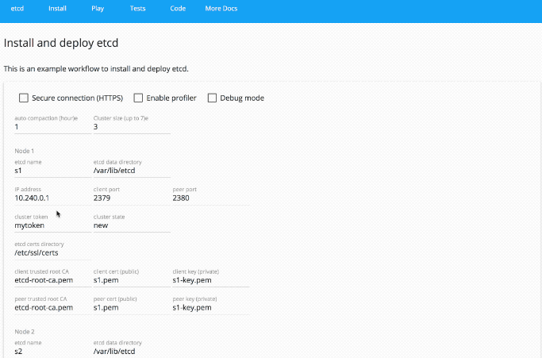

# etcdlabs

[](https://goreportcard.com/report/github.com/coreos/etcdlabs)
[](https://travis-ci.org/coreos/etcdlabs)
[](https://godoc.org/github.com/coreos/etcdlabs)

- [etcd website](http://play.etcd.io)



See [etcd-play][old-etcd-play] for old code.

#### Technology Used

- Frontend
    - [Angular](https://angular.io/)
    - [Angular Material](https://github.com/angular/material2)
    - [TypeScript](https://www.typescriptlang.org/index.html)
- Backend
    - [Go](https://golang.org/)

[old-etcd-play]: https://github.com/coreos/etcd-play
[cistat]: https://travis-ci.org/coreos/etcdlabs
[etcdlabs-godoc]: https://godoc.org/github.com/coreos/etcdlabs

#### Build and Push to gcr.io

```bash
./scripts/docker/build-push.sh
```

#### Run locally

```bash
./scripts/docker/etcdlabs.sh
```

```bash
curl -L http://localhost:4200/health
1
```

And open http://localhost:4200
